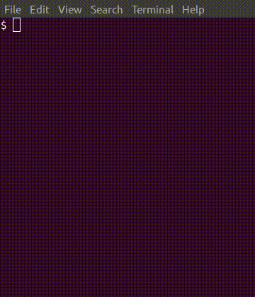

# Tetran

[](https://github.com/fortran-gaming/tetran/actions)
[](https://github.com/fortran-gaming/tetran/actions)

Text/console falling-block tetromino game written in object-oriented Fortran 2008.



* user-configurable playfield size
* Logs pieces played to `tetran.log` so you can recreate memorable games.
* uniform random game piece generation.
* clean, object-oriented Fortran 2008 syntax, well structured using Fortran 2008 `submodule`
* Curses (Ncurses, PDcurses) used for display, called directly from Fortran code.

## Prereq

Tetran works on Mac, Linux, native Windows, Cygwin, Windows Subsystem for Linux.
Requires:

* Fortran 2008 compilers supporting Fortran `submodule`
* Meson

Obtain these items by:

* Linux / WSL: `apt install gfortran libncurses-dev ninja-build` and then `pip install meson`
* Mac: `brew install gcc meson ninja`
* Cygwin: `setup-x86_64.exe -P libncurses-devel meson ninja gcc-gfortran`

## Build

from the top-level `tetran` directory:

```bash
meson build

meson test -C build

meson install -C build
```

Meson will automatically build PDcurses if Curses isn't available on your system already.

### Compiler selection

As usual, optionally specify a compiler by setting environment variables `FC` AND `CC`.
Failing to set both results in segfaults.

## Play

From any Terminal:

```bash
tetran
```

The command line options are described next in the following sections.

### difficulty level

adjust cadence of falling blocks with `-d` option, including decimal point:

```bash
tetran -d 1.2
```

Higher number increase difficulty. Must include decimal point.

### Playfield size

specify width and height of the playfield with `-s` option:

```bash
tetran -s 20 15
```

### play against computer

The computer player is for now rudimentary, the AI algorithm is being developed offline.

```bash
tetran -p 2
```

### debug mode

Debug logging is enabled by:

```bash
tetran --debug
```

### Controls

Other "secret" cheat keys exist! You can also use arrow keys.

  Key      |  Effect
-----------|-----------------------------
  W        | Rotate piece
  A/D      | Left and right respectively
  S        | Move down faster
  Q or Esc | Exit the game

## Notes

### Block Randomness

unlike some games, block distribution is uniformly random as confirmed by:

```sh
./blockrand
```

#### Normalized benchmarks

using `time ./blockrand 100000000` *relative normalized* execution times were:

`-O3`:

    GNU   1.00 (fastest normalized)
    Flang 1.90
    PGI:  1.82
    ifort 8.22

Tested with:

* Flang &ge; 7
* Gfortran &ge; 6
* Intel Fortran 2019
* PGI &ge; 19.10

### References

* [Control codes](https://en.wikipedia.org/wiki/C0_and_C1_control_codes)
* legacy / demo author:   [Lewis Bobbermen](https://github.com/lewisjb)
